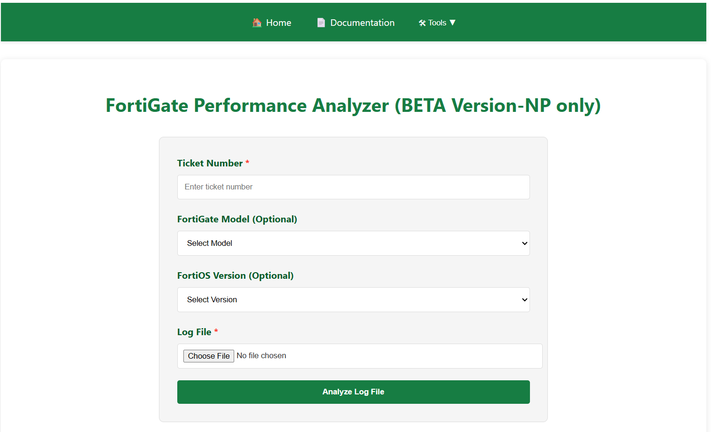
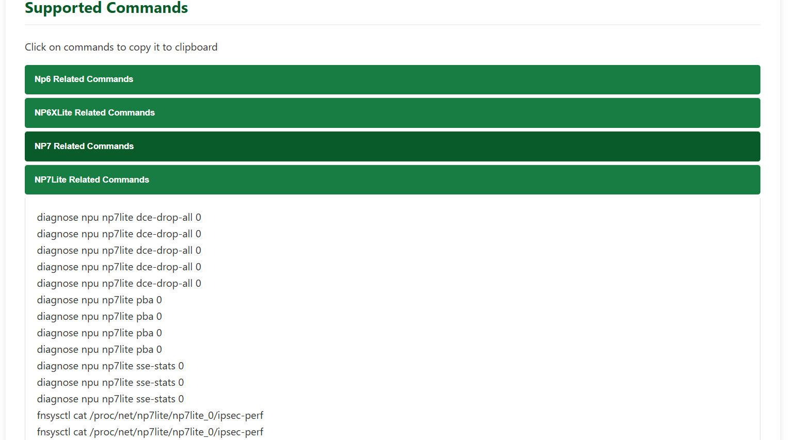
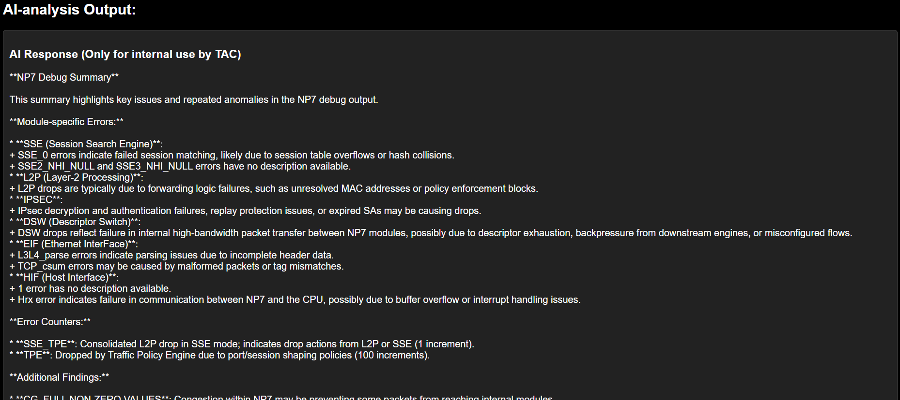
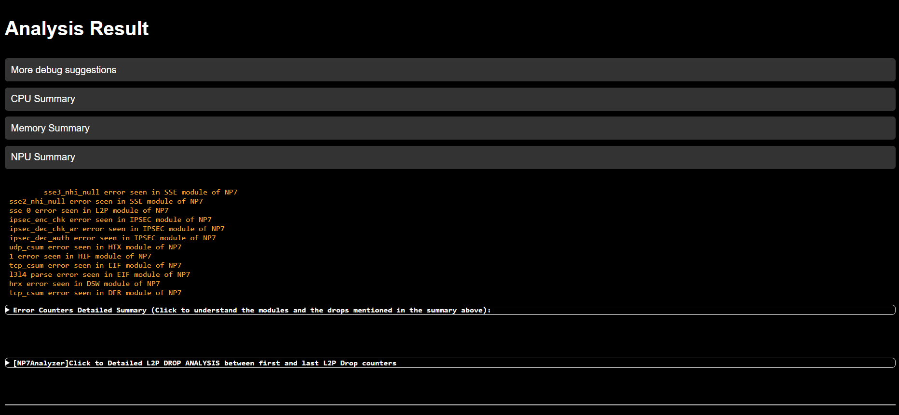

# System Performance Analyzer – Intro to the Tool

## 🧪 BETA Notice

**System Performance Analyzer** is currently in **BETA** and supports **NP (Network Processor)** analysis only. CPU, memory, and session diagnostics are being enriched as development progresses.

---

## 🛠️ Accessing the Tool

* The System Performance Analyzer is currently accessible via VPN or in Office at the IP address <a href="http://10.128.202.246:7777/" target="_blank">`10.128.202.246:7777`</a> or from our <a href="http://10.128.202.246:8863/" target="_blank">homepage</a>.

---

## 🖼️ Main Interface – Upload and Analyze

- Upload performance log files (Recommended to use the debug commands listed on the main page of the tool.).
- Click **Analyze** to begin automatic parsing and AI-assisted evaluation.

---

## ⚙️ Supported Commands (Click-to-Copy Enabled)

This section in the tool displays a list of supported CLI commands. Each command can be copied to clipboard with a single click — making it easy to retrieve exactly what you need.

---

## 🧠 AI-Powered Insights

The **AI Analysis** section provides intelligent insights and summaries across all supported performance domains:

- **Root cause suggestions** for CPU spikes, memory pressure, NP drops, and session table behavior.
- Clear **next steps** including recommended diagnostics or configuration checks.

---

## 📊 Enriched Logs Breakdown

The enriched logs are separated into **dedicated sections** for better readability and focus:

### 🧮 CPU Logs
- Parsed data from `get sys perf stat`, `diag sys top`, `mpstat` and others.
- Highlights abnormal user/system/softirq percentages and top consumers.

### 💾 Memory Logs
- Parses memory breakdowns, slab usage, shmem levels, and anomalies.
- Flags memory leaks or daemon-level memory growth.

### 📡 NPU Logs
- Extracted from NP6/NP6XLite/NP7 debug outputs.
- Identifies drops, stage bottlenecks, repeat counters, and leakage signs.

### 🧰 Suggested Debugs
- Based on parsed content and AI suggestions, this section lists:
  - Recommended CLI commands
  - Specific flags or filters
  - Daemon-specific debug paths (e.g., `diag debug app wad`, `fnsysctl cat /proc/<pid>/smaps`)

---

## 📘 Overview

The **System Performance Analyzer** is a new automation tool that simplifies analysis across:

- **CPU**
- **Memory**
- **Session**
- **All NP chip families (NP6, NP6XLite, NP7)**

Whether you're troubleshooting real-time CPU spikes, digging into memory usage patterns, or decoding packet drop behavior on NP hardware, this tool highlights the key findings automatically and guides you to the next steps.

---

## 🗣️ Share Your Feedback

Your input is essential to making this tool better. Share your feedback and use-cases with us:

- Click the <a href="https://forms.office.com/pages/responsepage.aspx?id=eMQ2LAA9L0WFNUg5b18B8BdRR8fI0dRMpEqJ2cz_JtJUNE4wOVhCVVc5TzlZWk9JSTVRMUo0RUhEVi4u" target="_blank"> Report new use-cases </a> link to help us expand functionality.

---
